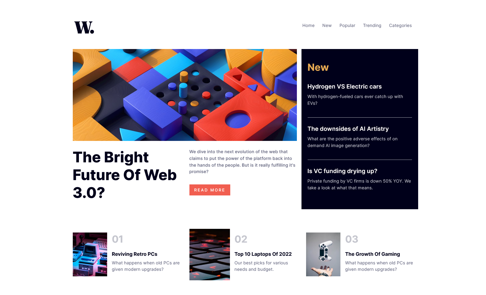

# Frontend Mentor - News homepage solution

This is a solution to the [News homepage challenge on Frontend Mentor](https://www.frontendmentor.io/challenges/news-homepage-H6SWTa1MFl). Frontend Mentor challenges help you improve your coding skills by building realistic projects. 

## Table of contents

- [Overview](#overview)
  - [The challenge](#the-challenge)
  - [Screenshot](#screenshot)
  - [Links](#links)
- [My process](#my-process)
  - [Built with](#built-with)
  - [Continued development](#continued-development)
- [Author](#author)

## Overview

### The challenge

Users will be able to:

- View the optimal layout for the interface depending on their device's screen size
- See hover and focus states for all interactive elements on the page
- Toggle the mobile menu (requires some JavaScript)

### Screenshot

- Solution URL: [Add solution URL here](https://your-solution-url.com)
- Live Site URL: [Add live site URL here](https://your-live-site-url.com)

## My process

- This website was built with Semantic HTML 5 syntax, CSS styles, JS and Bootstrap Library.

### Built with

- Semantic HTML5 markup
- CSS custom properties
- Flexbox
- CSS Grid
- desktop-first workflow
- [Library] - Bootstrap
- [Styled Components](https://styled-components.com/) - For styles

### Continued development
 This project enabled me use grid layouts. 

## Author

- Frontend Mentor - [@Chromax-D](https://www.frontendmentor.io/profile/Chromax-D)
- Twitter - [@GodskeyD](https://www.twitter.com/GodskeyD)
